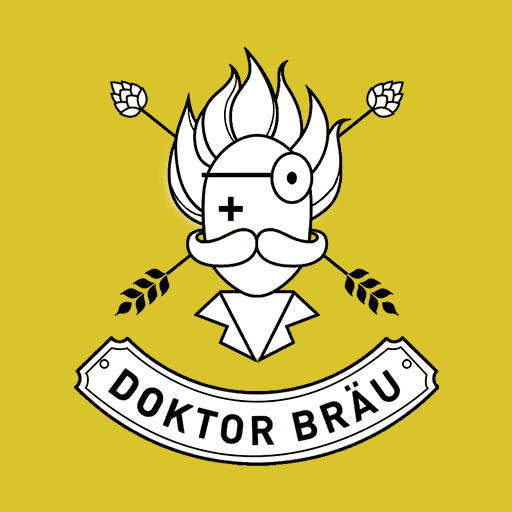

> Doktor Brau Beer

# DoktorApp

Project created by students of the Advertising and Propaganda and Application course and Developed by a 
student of the Information Systems course

## Technologies

- IONIC3
- Firebase

## Versions

Just one version created.

## Credits

Work presented to the course Media discipline
of Advertising and Propaganda, of the University of
Sapucaí Valley; guided by Prof. Master Juliana Leopoldino.

> Creators of the Project

            AMANDA CRISTINA FERREIRA SILVA 
            ANDRESSA DA SILVA PRATES
            FABIANA MÁRCIA RIBEIRO
            HELDER FERNANDES RIBEIRO
            NATÁLIA DE ASSIS OLIVEIRA
            NAYARA PÁDUA SILVERIO 

> Developer
            
            MISAEL KELVINY
